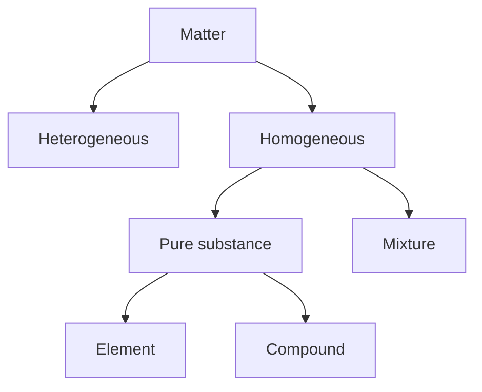

# 基本化学假设

## 质量守恒定律

Law of Conservation of Mass

Lavoisier’s law

拉瓦锡 1743~1794

The total mass of materials present after a chemical reaction is the same as the total mass present before the reaction.

## 定比定律

Law of Definite Proportions / Law of Constant Composition

Joseph Proust 1754~1826

The elemental composition of a compound is always the same.

## 倍比定律

Law of Multiple Proportions

道尔顿 1766~1844

If two elements A and B combine to form more than one compound, the masses of B that can combine with a given mass of A are in the ratio of small whole numbers.

## 道尔顿原子论

Dalton’s Atomic Theory

道尔顿 1766~1844

1. Each element is composed of extermely small particles called atoms.

2. All atoms of a given element are identical, but the atoms of one element are different from the atoms of all other elements.

3. Atoms of one element cannot be changed into atoms of a different element by chemical reactions; atoms are neither created nor destroyed in chemical reactions.

4. Compounds are formed when atoms of more than one element combine; a given compound always has the same relative number and kind of atoms.

# 总结

## 物质

## 原子

$$
\text{substance} = \sum \text{atoms}_i \quad (i=1,2,3,\dots)\\[20px]
$$

## 质量守恒定律

在化学反应中，封闭系统内，反应物的总质量等于生成物的总质量。质量既不会凭空产生，也不会凭空消失。

$$
\sum m_{\text{reactants}} = \sum m_{\text{products}}\\[20px]
$$

## 电荷守恒定律

