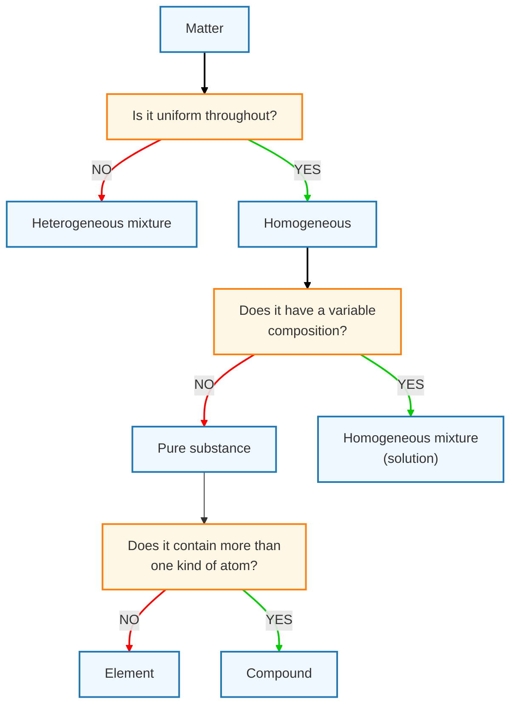

# 基本概念

## 基本概念

元素 elements
原子 atoms
分子 molecules

states of matter
gas
liquid
solid

pure substance
elements
compounds
mixtures

law of constant composition
law of definite proportions

physical properties
chemical properties

intensive properties
extensive properties

Physical and Chemical Changes

Precision and Accuracy

$$
\ce{2H2 + O2 -> 2H2O}
$$
