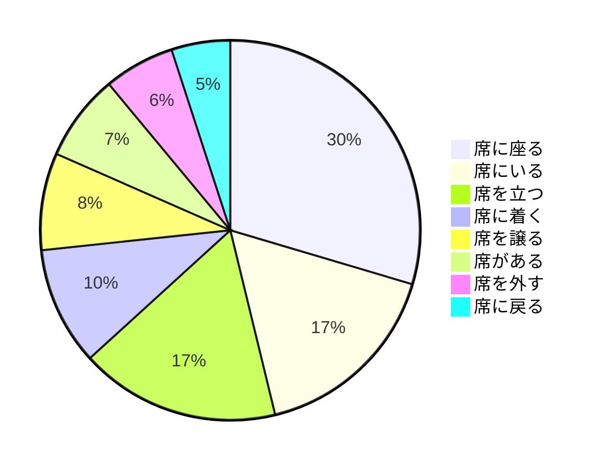
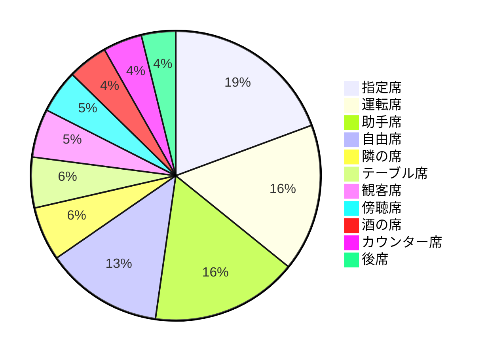

# 席

**体言**

## 席 + 助詞

| 席に座る | 席にいる | 席に着く | 席に戻る | 席を立つ | 席を譲る | 席を外す | 席がある |
| :--: | :--: | :--: | :--: | :--: | :--: | :--: | :--: |
| 2583 | 1450 | 880 | 437 | 1487 | 722 | 526 | 644 |

## 他の名詞 + 席

| 指定席 | 運転席 | 助手席 | 自由席 | テーブル席 | 観客席 | 傍聴席 | カウンター席 | 後席 | 隣の席 | 酒の席 |
| :--: | :--: | :--: | :--: | :--: | :--: | :--: | :--: | :--: | :--: | :--: |
| 2738 | 2332 | 2325 | 1857 | 800 | 767 | 685 | 617 | 543 | 855 | 634 |

<ruby>後席<rt>こうせき</rt></ruby>
