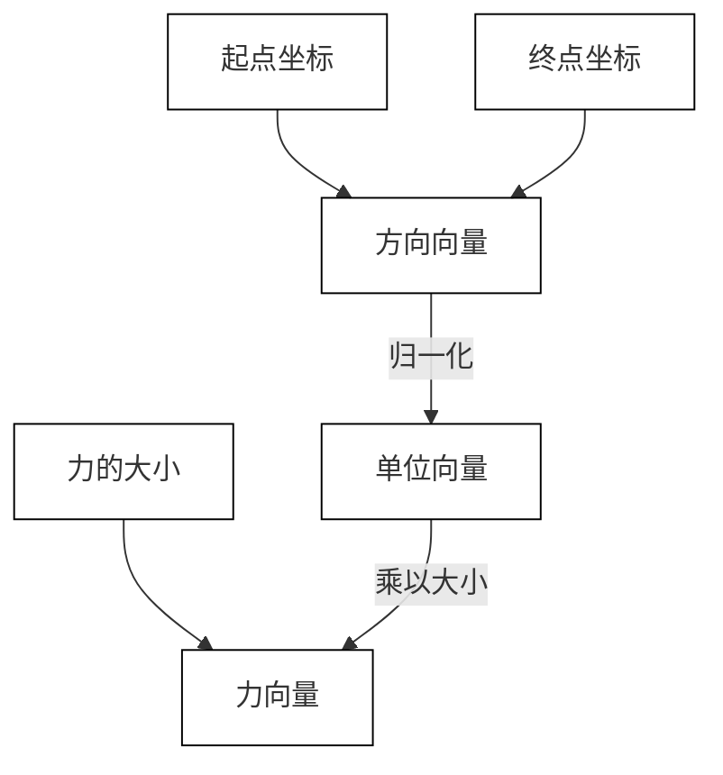

# 力向量

Force Vector

力在力学中通常由以下三个要素唯一确定：

1. **大小** (magnitude)

2. **方向** (direction)

3. **作用点** (point of application)

其中，方向和作用点这两个要素又共同决定**作用线** (line of action)。

> 本文讨论的力向量，均假设作用于同一作用线上。倘若没有作用于同一作用线上，那么将会涉及到对于力矩 (moment) 的讨论。见：[力系的合力与合力矩](/物理学/力学/静力学/力系的合力与合力矩.md)。

建立力向量的一般流程：



力向量是描述物体所受力的大小与方向的基本工具。在力学中，准确表示力的方向和大小对于分析物体的受力情况至关重要。常用的三种力向量描述方式如下：

> 无论采用哪种向量描述方式，最终在计算时，都应该转化为**笛卡尔坐标**的形式。

## 笛卡尔坐标系

Cartesian Coordinates

笛卡尔坐标系以三个相互垂直的坐标轴 $x$、$y$、$z$ 来描述空间中的位置和方向。在此坐标系下，力向量通常以其在各坐标轴上的分量形式表示：

$$
\mathbf{A} = A_x \mathbf{i} + A_y \mathbf{j} + A_z \mathbf{k}
$$

其中，$A_x, A_y, A_z$ 分别是力在 $x, y, z$ 方向上的分量，$\mathbf{i}, \mathbf{j}, \mathbf{k}$ 是对应的单位向量。

<div style="width: fit-content; margin: 0 auto;">
    
</div>

## 球坐标系

Spherical Coordinates

球坐标系适用于描述以某点为原点的三维空间中的向量，特别适合处理具有球对称性质的问题。力向量通过极径 $\rho$、极角（倾角）$\phi$ 和方位角 $\theta$ 来表达：

$$
\mathbf{A} = A \sin\phi \cos\theta \, \mathbf{i} + A \sin\phi \sin\theta \, \mathbf{j} + A \cos\phi \, \mathbf{k}
$$

其中，$A = |\mathbf{A}|$ 是力的大小，$\phi$ 是与 $z$ 轴的夹角（0 到 $\pi$），$\theta$ 是在 $xy$ 平面内与 $x$ 轴的夹角（0 到 $2\pi$）。

<div style="width: fit-content; margin: 0 auto;">
  
</div>

## 大小与坐标方向角

Magnitude and Coordinate Direction Angles

这种表示方法直接用力的大小 $A$ 与其在三个坐标轴方向上的方向角 $\alpha, \beta, \gamma$ 来描述。力向量可写成：

$$
\mathbf{A} = A \cos\alpha \, \mathbf{i} + A \cos\beta \, \mathbf{j} + A \cos\gamma \, \mathbf{k}
$$

方向角 $\alpha, \beta, \gamma$ 分别为力向量与 $x, y, z$ 轴的夹角，它们满足如下归一化关系：

$$
\cos^2\alpha + \cos^2\beta + \cos^2\gamma = 1
$$

<div style="width: fit-content; margin: 0 auto;">
    
</div>

## Python 力向量的描述与转换

下面示例展示了如何在三种力向量描述方式之间进行转换：

```Python
import numpy as np

# 示例向量（笛卡尔坐标）
F_cartesian = np.array([x, y, z])

# 示例向量（球坐标）
# pho: 径向距离，theta: 方位角（绕z轴），phi: 极角（与z轴夹角）
F_spherical = np.array([pho, theta, phi])

# 示例向量（大小与坐标方向角）
# magnitude: 向量大小，alpha/beta/gamma: 与x/y/z轴的夹角
F_angles = np.array([magnitude, alpha, beta, gamma])

```

### 坐标转换函数实现

```Python
import numpy as np

def spherical_to_cartesian(spherical_coords: np.ndarray) -> np.ndarray:
    """
    球坐标 转 笛卡尔坐标

    参数:
        spherical_coords (np.ndarray): 形状为 (3,)，元素依次为
            - rho: 径向距离，标量 >= 0
            - theta: 方位角（绕 z 轴的旋转角），单位弧度，范围通常为 [0, 2π)
            - phi: 极角（从 z 轴向下的夹角），单位弧度，范围为 [0, π]

    返回:
        np.ndarray: 形状为 (3,)，对应笛卡尔坐标 (x, y, z)
    """
    rho, theta, phi = spherical_coords
    x = rho * np.sin(phi) * np.cos(theta)
    y = rho * np.sin(phi) * np.sin(theta)
    z = rho * np.cos(phi)
    return np.array([x, y, z])

def angles_to_cartesian(angles: np.ndarray) -> np.ndarray:
    """
    方向角 转 笛卡尔坐标

    参数:
        angles (np.ndarray): 形状为 (4,)，元素依次为
            - magnitude: 向量的幅值，标量 >= 0
            - alpha: 与 x 轴的夹角，单位弧度，范围 [0, π]
            - beta: 与 y 轴的夹角，单位弧度，范围 [0, π]
            - gamma: 与 z 轴的夹角，单位弧度，范围 [0, π]

    注意:
        方向角满足关系：cos²(alpha) + cos²(beta) + cos²(gamma) = 1。
        输入角度应满足该几何约束。

    返回:
        np.ndarray: 形状为 (3,)，对应笛卡尔坐标 (x, y, z)
    """
    magnitude, alpha, beta, gamma = angles
    x = magnitude * np.cos(alpha)
    y = magnitude * np.cos(beta)
    z = magnitude * np.cos(gamma)
    return np.array([x, y, z])


def cartesian_to_spherical(vec: np.ndarray) -> np.ndarray:
    """
    笛卡尔坐标 转 球坐标

    参数:
        vec (np.ndarray): 形状为 (3,)，对应笛卡尔坐标 (x, y, z)

    返回:
        np.ndarray: 形状为 (3,)，元素依次为
            - rho: 径向距离，标量 >= 0
            - theta: 方位角（绕 z 轴的旋转角），单位弧度，范围 (-π, π]
            - phi: 极角（从 z 轴向下的夹角），单位弧度，范围 [0, π]

        当输入向量为零向量时，theta 和 phi 返回 np.nan 表示未定义。
    """
    x, y, z = vec
    rho = np.linalg.norm(vec)

    if rho == 0:
        theta = phi = np.nan
    else:
        theta = np.arctan2(y, x)
        phi = np.arctan2(np.sqrt(x**2 + y**2), z)

    return np.array([rho, theta, phi])


def cartesian_to_angles(vec: np.ndarray) -> np.ndarray:
    """
    笛卡尔坐标 转 方向角

    参数:
        vec (np.ndarray): 形状为 (3,)，对应笛卡尔坐标 (x, y, z)

    返回:
        np.ndarray: 形状为 (4,)，元素依次为
            - magnitude: 向量的幅值，标量 >= 0
            - alpha: 与 x 轴的夹角，单位弧度，范围 [0, π]
            - beta: 与 y 轴的夹角，单位弧度，范围 [0, π]
            - gamma: 与 z 轴的夹角，单位弧度，范围 [0, π]

        当幅值为 0（零向量）时，alpha、beta 和 gamma 返回 np.nan 表示未定义。
    """
    x, y, z = vec
    magnitude = np.linalg.norm(vec)

    if magnitude == 0:
        alpha = beta = gamma = np.nan
    else:
        alpha = np.arccos(x / magnitude)
        beta = np.arccos(y / magnitude)
        gamma = np.arccos(z / magnitude)

    return np.array([magnitude, alpha, beta, gamma])

```

⚠️ 上述代码实现中，使用了 `numpy` 库中的 `ndarray`。但在涉及符号计算或含有未知数的情况下，可以使用 `sympy` 库中的 `Matrix` 作为替代。
